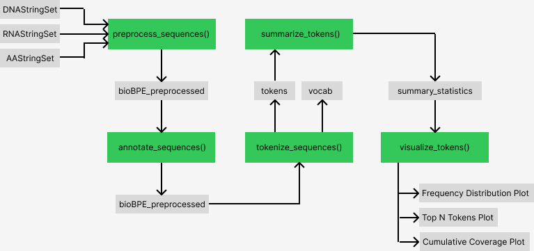

<!-- README.md is generated from README.Rmd. -->

# BioTokenizeR

Biology-aware Byte-pair Encoding (BPE) Tokenizer for biological
sequences

## Description

`BioTokenizeR` is an R package designed to streamline the tokenization
and analysis of biological sequence data, including DNA, RNA, and
protein sequences. It provides functions to process raw sequences,
generate tokenized representations, compute metrics such as token
frequency and length distributions, and visualize the results in a
research-ready format.

The package enhances current bioinformatics workflows by offering a
reproducible, automated framework for sequence tokenization and
analysis. Unlike other tools that focus solely on sequence alignment or
motif search, `BioTokenizeR` allows researchers to quantitatively
explore sequence composition and token-based features efficiently.

This package was developed in the following environment:

    R Version: 4.5.1 (2025-06-13) -- "Great Square Root"
    Platform: aarch64-apple-darwin20
    Running under: MacOS Sequoia 15.6.1

## Installation

To install the latest version of the package:

``` r
require("devtools")
devtools::install_github("sophiamjiali/BioTokenizeR", build_vignettes = TRUE)
library("BioTokenizeR")
```

To run the Shiny app:

``` r
run_BioTokenizeR()
```

## Overview

The following commands provide a quick overview of the package

``` r
ls("package:BioTokenizeR")
browseVignettes("BioTokenizeR")
```

User-accessible functions include:

- `preprocess_sequences()`: preprocess raw sequences for tokenization
- `annotate_sequences()`: adds biological annotations to preprocessed
  sequences
- `tokenize_sequences()`: performs BPE-style tokenization of the
  sequences
- `summarize_sequences()`: computes summary statistics of the tokenized
  sequences
- `visualize_sequences()`: visualizes the tokenization summary
  statistics (all plots)
- `plot_token_frequency_distribution()`: visualizes the token frequency
  distribution
- `plot_top_tokens()`: visualizes the top N tokens
- `plot_cumulative_coverage()`: visualizes the cumulative coverage
  across ranks



## Contributions

The author of BioTokenizeR is Sophia Li. BioTokenizeR contains eight
functions, all of which were written by the author while making use of
functions from third-party R packages.

The *preprocess_sequences* function preprocesses raw biological
sequences for tokenization. It uses the Biostrings package to handle
sequence objects, while all preprocessing logic (e.g., trimming,
filtering invalid sequences) was implemented by the author.

The *annotate_sequences* function adds biological annotations to
preprocessed sequences. Annotation handling and integration logic were
written by the author; no third-party packages are directly required for
annotation.

The *tokenize_sequences* function performs BPE-style tokenization of the
sequences. It uses base R and Biostrings for sequence manipulation,
while all tokenization logic was implemented by the author.

The *summarize_sequences* function computes summary statistics of the
tokenized sequences, including token frequency, length distributions,
and coverage metrics. It uses base R functions for data aggregation and
summarization; all summary calculations were written by the author.

The *visualize_sequences* function generates all tokenization summary
plots. It relies on ggplot2 for plotting, while the data preparation and
plot structuring were implemented by the author.

The *plot_token_frequency_distribution* function visualizes token
frequency distributions. It uses ggplot2 for plotting, with the author
implementing the computation of frequency tables and plot formatting.

The *plot_top_tokens* function visualizes the top N most frequent
tokens. The function uses ggplot2 for plotting, while all ranking,
selection, and plot formatting logic was written by the author.

The *plot_cumulative_coverage* function visualizes the cumulative
coverage of tokens across ranks. It relies on ggplot2 for visualization,
with coverage calculation and plotting logic implemented by the author.

ChatGPT developed by OpenAI was used in the creation of this package
only for the purpose of debugging the code and ensuring all `roxygen2`
documentation was formatted correctly.

## References

- Chang W, Cheng J, Allaire J, Sievert C, Schloerke B, Xie Y, Allen J,
  McPherson J, Dipert A, Borges B (2025). *shiny: Web Application
  Framework for R*. <doi:10.32614/CRAN.package.shiny>
  <https://doi.org/10.32614/CRAN.package.shiny>, R package version
  1.11.1, <https://CRAN.R-project.org/package=shiny>.

- Dotan E, Jaschek G, Pupko T, Belinkov Y (2024). Effect of tokenization
  on transformers for biological sequences. Bioinformatics, 40(4):
  btae196. <doi:10.1093/bioinformatics/btae196>. PMCID: PMC11055402.

- Grolemund, G. (2015). Learn Shiny - Video Tutorials.
  <https://shiny.rstudio.com/tutorial/>.

- Iuchi H, Matsutani T, Yamada K, Iwano N, SumiS, Hosoda S, Zhao S,
  Fukunaga T, Hamada M (2021). Representation learning applications in
  biological sequence analysis. Computational and Structural
  Biotechnology Journal, 19: 3198-3208.
  <doi:10.1016/j.csbj.2021.05.039>.

- Medvedev A, Viswanathan K, Kanithi P (2025).BioToken and BioFM -
  Biologically‑Informed Tokenization Framework. bioRxiv.
  <https://doi.org/10.1101/2025.03.27.645711>

- Müller K, Wickham H (2025). tibble: Simple Data Frames.
  <doi:10.32614/CRAN.package.tibble>
  <https://doi.org/10.32614/CRAN.package.tibble>, R package version
  3.3.0, <https://CRAN.R-project.org/package=tibble>.

- Pagès H, Aboyoun P, Gentleman R, DebRoy S (2025). *Biostrings:
  Efficient manipulation of biological strings*.
  <doi:10.18129/B9.bioc.Biostrings>
  <https://doi.org/10.18129/B9.bioc.Biostrings>, R package version
  2.76.0, <https://bioconductor.org/packages/Biostrings>.

- Pagès H, Lawrence M, Aboyoun P (2025). *S4Vectors: Foundation of
  vector-like and list-like containers in Bioconductor*.
  <doi:10.18129/B9.bioc.S4Vectors>
  <https://doi.org/10.18129/B9.bioc.S4Vectors>, R package version
  0.48.0, <https://bioconductor.org/packages/S4Vectors>.

- Ponty Y, Termier M, Denise A (2006). GenRGenS: software for generating
  random genomic sequences and structures. Bioinformatics, 22(12):
  1534-1535. <doi:10.1093/bioinformatics/btl113>.

- R Core Team (2024). *R: A Language and Environment for Statistical
  Computing*. R Foundation for Statistical Computing, Vienna, Austria.
  <https://www.R-project.org/>.

- R Core Team (2025). *R: A Language and Environment for Statistical
  Computing*. R Foundation for Statistical Computing, Vienna, Austria.
  <https://www.R-project.org/>.

- Sennrich R, Haddow B, Birch A (2016). Neural Machine Translation of
  Rare Words with Subword Units. Proceedings of the 54th Annual Meeting
  of the Association for Computational Linguistics. Association for
  Computational Linguistics, 1715–1725.
  <https://aclanthology.org/P16-1162>.

- Wickham H (2016). ggplot2: Elegant Graphics for Data Analysis.
  Springer-Verlag New York. ISBN 978-3-319-24277-4,
  <https://ggplot2.tidyverse.org>.

- Wickham H, Pedersen T, Seidel D (2025). *scales: Scale Functions for
  Visualization*. <doi:10.32614/CRAN.package.scales>
  <https://doi.org/10.32614/CRAN.package.scales>, R package version
  1.4.0, <https://CRAN.R-project.org/package=scales>.

- Wickham H, François R, Henry L, Müller K, Vaughan D (2023). dplyr: A
  Grammar of Data Manipulation. <doi:10.32614/CRAN.package.dplyr>
  <https://doi.org/10.32614/CRAN.package.dplyr>, R package version
  1.1.4, <https://CRAN.R-project.org/package=dplyr>.

## Acknowledgements

This package was developed as part of an assessment for 2025 BCB410H:
Applied Bioinformatics course at the University of Toronto, Toronto,
CANADA. BioTokenizeR welcomes issues, enhancement requests, and other
contributions. To submit an issue, use the GitHub issues.
